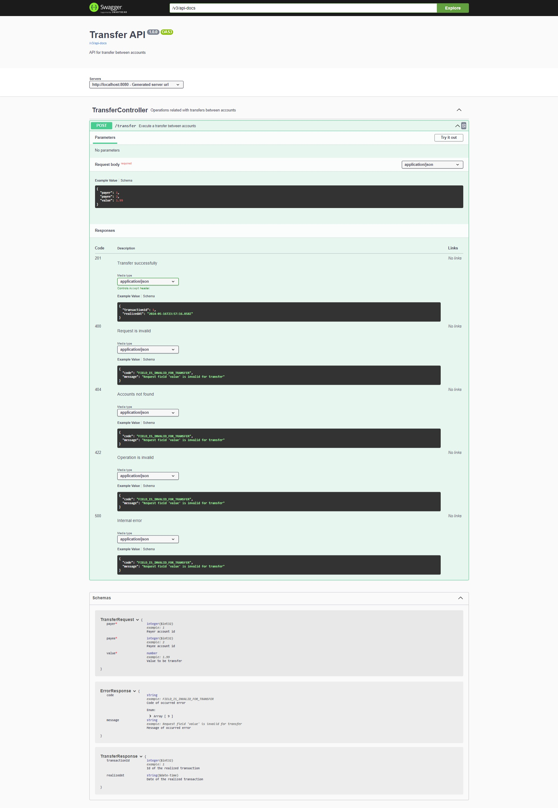

# Account API

This document is available in [English](README-en.md), but it is also available in [Portuguese](README.md).

## Overview

This project is my reactive implementation of the [Backend PickPay](https://github.com/PicPay/picpay-desafio-backend?tab=readme-ov-file#para-o-dia-da-entrevista-técnica) challenge. The challenge consists of implementing a simplified PicPay, aimed at creating a system for transfers between accounts that integrates with an authorizer and provides an asynchronous flow for sending notifications to both the payer and the beneficiary.

In summary, the main rules of the API are that the account must have a balance to execute the transfer, and merchant accounts can only receive and not send transfers.

Additionally, the account storage table should not allow accounts with the same email or CPF/CNPJ.

The reactive Spring model was used for implementing the API logic, database communication, external integrations, and Kafka producer and consumer.

## Technologies


## Architecture


## Initial Data

### Accounts

| id | legal_identifier | email         | full_name           | password      | identifier_type | balance  |
|----|------------------|---------------|---------------------|---------------|-----------------|----------|
| 1  | 81748010069      | ww@email.com  | Walter White        | Heisenberg123 | INDIVIDUAL      | 5000.00  |
| 2  | 37031860000100   | lph@email.com | Los PolLos Hermanos | GusFring123   | MERCHANT        | 10000.00 |

## How to Use

1. Make sure Docker is installed on your machine.
2. Clone this repository to your local environment.
3. Navigate to the project directory.
4. In the terminal, run the following command to build and start the Docker container:
    - On Linux, run:
        ```bash
        docker compose up
        ```

    - On Windows, run:
        ```bash
        docker-compose up
        ```

5. After building the containers and starting the application, access [Swagger](http://localhost:8080/webjars/swagger-ui) to view its documentation. You should see the following screen: 

**Notes:**
- Make sure that ports `8080`, `9092`, and `5432` are not being used by another application on your system to avoid conflicts. If necessary, you can modify the port mapping in the [docker-compose.yml](docker-compose.yaml) file.


