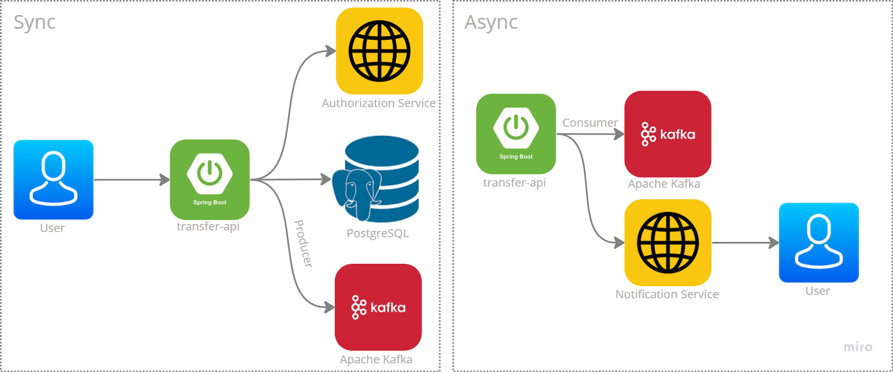
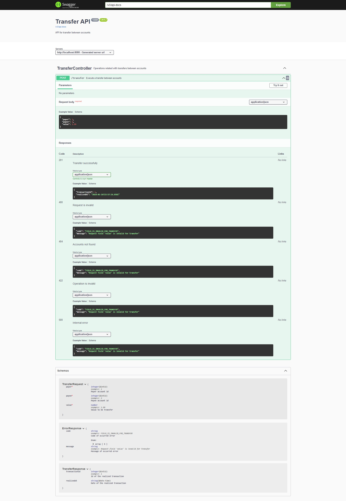

# Transfer API

Este documento está disponível em [Português](README.md), porém também está disponível em [Inglês](README-en.md).

## Visão geral

Este projeto é minha implementação reativa do desafio [Backend PickPay](https://github.com/PicPay/picpay-desafio-backend?tab=readme-ov-file#para-o-dia-da-entrevista-técnica). Desafio que consiste na implementação de um PicPay simplificado, cujo objetivo é implementar um sistema de transferências entre contas que passe por uma integração com autorizador e forneça um fluxo assincrono de integração para envio de notificações ao pagador e beneficiário. 

Em suma as principais regras da API são de que a conta deve ter saldo para executar a trasnferência e contas do tipo lojista só podem receber e não enviar trasnferências.

Além disso, a tabela de armazenamento das contas não deve permitir contas com mesmo email ou CPF/CPNJ.

Tanto para a implementação de lógica da API, como para comunicação com o banco de dados, integrações externas, produtor e consumidor Kafka, foi usado o modelo do Spring Reativo.


## Tecnologias


## Arquitetura



## Dados Iniciais

### Contas

| id | legal_identifier | email         | full_name           | password      | identifier_type | balance  |
|----|------------------|---------------|---------------------|---------------|-----------------|----------|
| 1  | 81748010069      | ww@email.com  | Walter White        | Heisenberg123 | INDIVIDUAL      | 5000.00  |
| 2  | 37031860000100   | lph@email.com | Los PolLos Hermanos | GusFring123   | MERCHANT        | 10000.00 |


## Como Usar

1. Certifique-se de que o Docker esteja instalado em sua máquina.
2. Clone este repositório para o seu ambiente local.
3. Navegue até o diretório do projeto.
4. No terminal, execute o seguinte comando para construir e iniciar o contêiner Docker:
    - No Linux, execute:
        ```bash
        docker compose up
        ```

    - No Windows, execute:
        ```bash
        docker-compose up
        ```

5. Após a construção dos contêineres e a inicialização da aplicação, acesse [Swagger](http://localhost:8080/webjars/swagger-ui) para visualizar sua documentação. Você deverá ver a seguinte tela:


**Observações:**
- Certifique-se de que as portas `8080`, `9092` e `5432` não estão sendo utilizadas por outra aplicação em seu sistema para evitar conflitos. Se necessário, você pode modificar o mapeamento de porta no arquivo [docker-compose.yaml](docker-compose.yaml).
